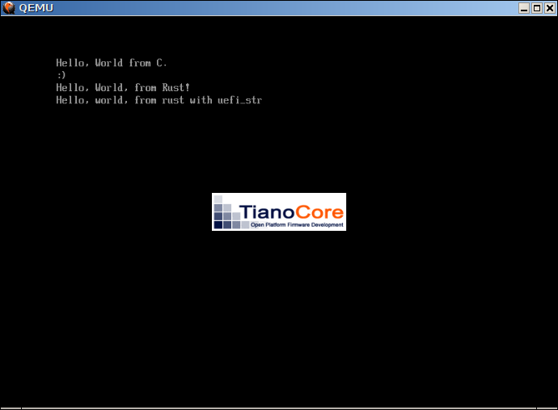
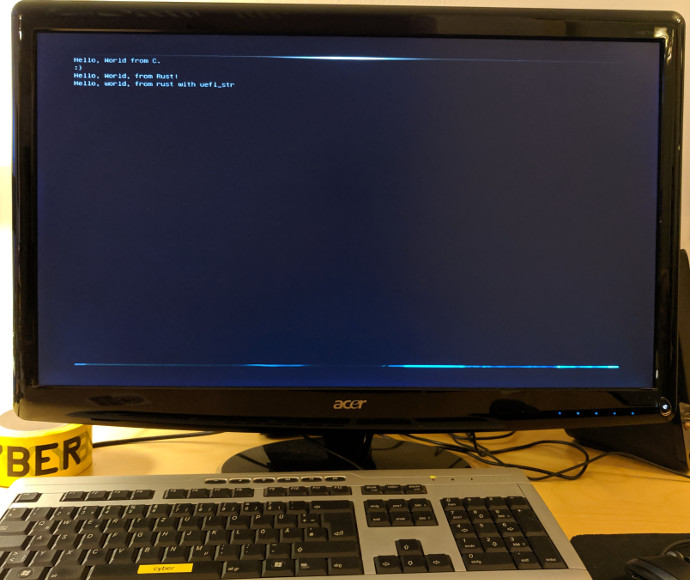

# uefi_playground
Playing with UEFI and Rust.

Starting with GNU EFI and [shim](https://github.com/rhboot/shim) as example, this code is a small C "Hello, World" example which hands over to Rust as soon an possible.

It demonstrates how to include Rust code in a new and unusual target from C.

## Demo

## Related Work

[Roderick Smith](https://www.rodsbooks.com/efi-programming/hello.html) provides a nice "Hello, World" UEFI tutorial, using C and GNU EFI.

For professional UEFI development in C and if [GNU EFI](https://directory.fsf.org/wiki/GNU_EFI) is not an option, [EDK II (TianoCore)](https://github.com/tianocore/edk2) is a huge framework for UEFI development.

Rust UEFI development could use [uefi-rs](https://github.com/rust-osdev/uefi-rs) directly, which is a native Rust library and does not rely on C to get bootstrapped. It allows to generate UEFI applications directly.

[Redox OS](https://www.redox-os.org/) is an OS written in Rust and can natively boot with UEFI. The UEFI part is also written in Rust.

[Trammell Hudson](https://media.ccc.de/v/34c3-9056-bringing_linux_back_to_server_boot_roms_with_nerf_and_heads) argues that we should replace UEFI with Linux directly.
